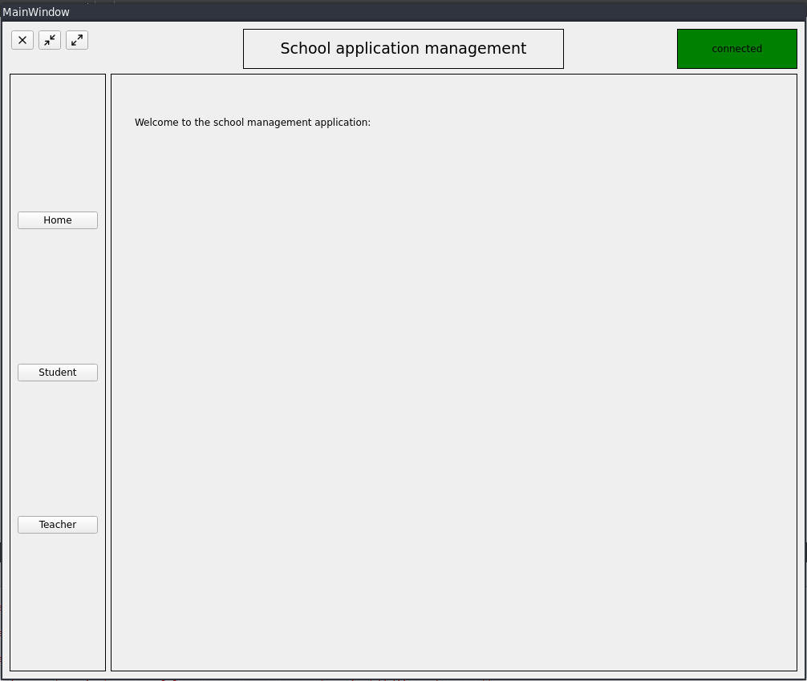
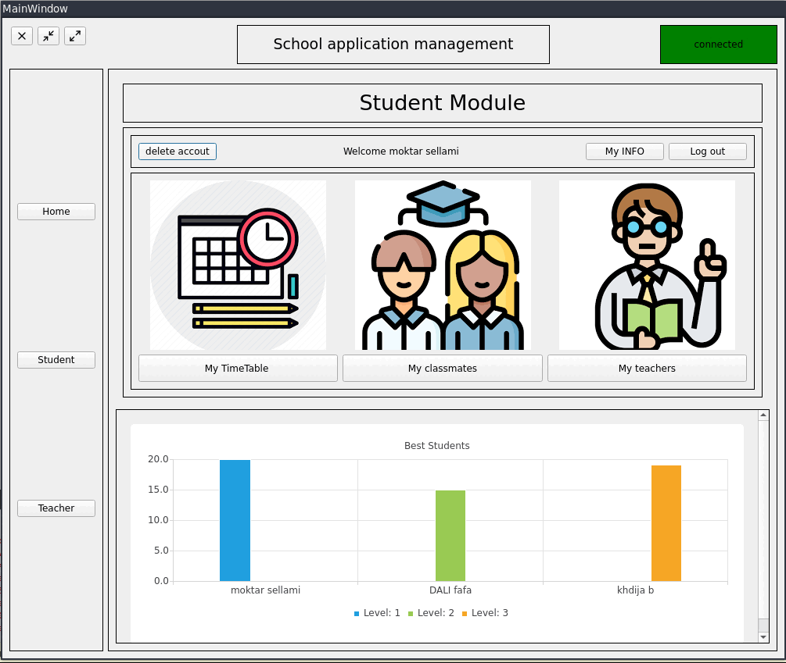
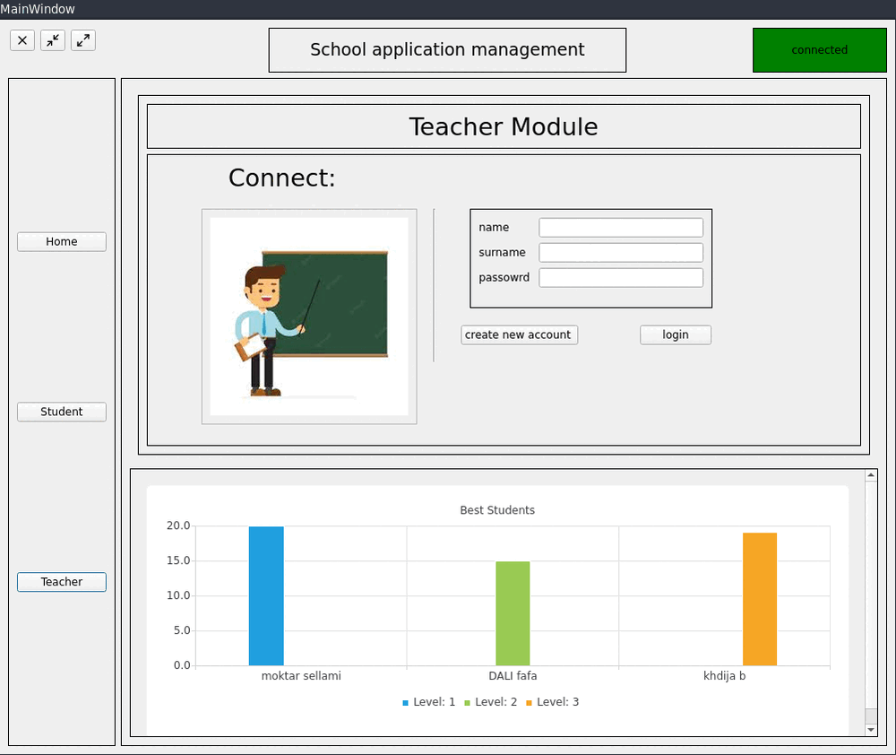

# qt-school_management

This is a school management project that provides student and teachers with diffrent functionalities that manages student and teachers profiles.

The project is programmed using the QT framework.   

## Features
- Student Module
- Teacher Module
- Real time Chart update 

# Student Module:
In this Module, a student can: 
- Login and logout 
- Create a new account, delete account
- update account  
- view class time table
- view classmates
- view teachers 

# Teacher Module 
In this Module, a teacher can: 
- Login and logout 
- Create a new account, delete account 
- view his students 

## Some insights: 
...

## how to use this code: 
1- You have to install the qt creator and qt6 from this link: [https://www.qt.io/download]

2- open qt creator then click `open project` then select this project.

3- click `run`

